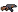

# ASAED (An's Adventure Escape Dungeon)

- Thử nghiệm game, các tính năng trong game và cấu trúc tổ chức code:
	* [Youtube](https://youtu.be/u5Rq9pGqljQ)
	* [Drive](https://drive.google.com/drive/folders/1gkx45nQFezb-bVZDmnZARltJpHn8vd_j?usp=sharing)

## Tác giả
- Sinh viên: Nguyễn Hải An
- Mssv: 23020001

## Giới thiệu game
> An's Adventure Escape Dungeon được lấy cảm hứng từ Soul Knight - một tựa game đi map, vượt level và đánh quái. Bạn trong vai một hiệp sĩ sẽ cố gắng tiêu diệt những con quái vật kì lạ để giải cứu chính mình khỏi mê cung.

> Game được cài đặt bằng ngôn ngữ C++ và thư viện SDL2

	

- [1. Cách cài đặt game](#1-cách-cài-đặt-game)
- [2. Bắt đầu chơi game](#2-bắt-đầu-chơi-game)
- [3. Cách chơi game](#3-cách-chơi-game)
- [4. Wiki](#4-wiki)
- [5. Chiến thắng](#5-chiến-thắng)
- [6. Source code](#6-source-code)
- [7. Về đồ họa của game](#7-về-đồ-họa-của-game)
- [8. Về source code của game](#8-về-source-code-của-game)
- [9. Điểm nhấn và điểm tâm đắc](#9-điểm-nhấn-và-điểm-tâm-đắc)
- [10. Lời kết](#10-lời-kết)

## 1. Cách cài đặt game
1. Clone trực tiếp từ trên github và chạy trực tiếp file thực thi .exe
	* **Bước 1**: Copy đường dẫn trong phần Code
	

	
	

	
	* **Bước 2**: Chọn thư mục bạn muốn lưu và mở cmd

	

	
	

	

	
	

	* **Bước 3**: Vào trong thư mục data và chạy file thực thi ASAED.exe
	

	
	

2. Trong trường hợp file ASAED.exe không chạy được ta thực hiện các bước sau
	* **Bước 1**: Cài đặt [CYGWIN](https://www.cygwin.com/), nếu máy bạn đã có rồi thì chuyển tới bước tiếp theo
	* **Bước 2**: Cài đặt [MingGW](), nếu máy bạn đã có rồi thì chuyển tới bước tiếp theo
	* **Bước 3**: Cài đặt bộ SDL2:
		+ [SDL2](https://github.com/libsdl-org/SDL/releases/tag/release-2.30.2)
		+ [SDL2_image](https://github.com/libsdl-org/SDL_image/releases)
		+ [SDL2_mixer](https://github.com/libsdl-org/SDL_mixer/releases)
		+ [SDL2_ttf](https://github.com/libsdl-org/SDL_ttf/releases)
	* **Bước 4**: Điều chỉnh đường dẫn SDL2 trong file Makefile cho phù hợp với thư mục SDL 2 bạn đặt trên máy
	

	
	

	* **Bước 5**: Chạy **Makefile** và thưởng thức game thôi

3. Game chỉ được thử nghiệm và chạy trên duy nhất **Windows 11**

## 2. Bắt đầu chơi game
* Tại màn hình bắt đầu, bạn chọn **START GAME** để bắt đầu trò chơi

	

* Bạn có thể chọn **OPTIONS** để điều chỉnh âm thanh và sound của trò chơi

	

	

## 3. Cách chơi game
* Bạn sử dụng 4 phím AWSD hoặc 4 phím mũi tên để di chuyển nhân vật
* Bạn click chuột trái để bắn súng
* Khi trong game, bạn nhấn ECS để pause game

## 4. Wiki
Nhân vật của bạn:

 

Các loại súng của nhân vật bạn:
 

|                                                  | Tên súng | Mô tả |
|--                                                |----------|-------|
|  | AK47   | Đây là súng khởi đầu bạn nhận được |
|             | Sgun    | Trông thì rất súng ngắm nhưng lại không phải vậy |
|       | Gatling    | Trước nòng Gatling .... bình đẳng |

Các loại quái vật trong game:
 

|                                                                   | Tên quái vật                 | Vũ khí                                                              | Skill   |
|--                                                                |--------------                 |-------------------------------------------------------------------  |-------  |
|                    | Orge                          |                 | Không có skill đặc biệt  |
|      | Wizzard                       |     | Bắn ra một tam giác xoay vòng |
|          | Orc                           |      | Không có skill đặc biệt |
|  | Necromancer                   |  | Bắn ra một cổng không gian triệu hồi các quái vật khác |

Các loại boss trong game:
 

|                                                  | Tên boss |
|--                                                |----------|
|  | Anubis   |
|   | Zulan    |

 

**Anubis**: Vị thần cổ đại
 

* **Skill 1**: Bắn ra một vòng tròn đạn, hãy cẩn thận núp sau những vật cản
* **Skill 2**: Bắn ra một vòng tròn đạn xoay theo 4 hướng
* **Trạng thái tức giận**: Khi Anubis còn dưới 50% máu, Anubis sẽ bắt đầu di chuyển và mở 2 skill 3, 4
* **Skill 3**: Bắn ra một vòng tròn đạn di chuyển phóng to thu nhỏ liên tục
* **Skill 4**: Bắn ra một viên đạn lớn có đạn con xoáy theo

 

**Zulan**: Vị thần công nghệ
 

* **Skill 1**: Bắn ra một vòng tròn đạn, hãy cẩn thận núp sau những vật cản
* **Skill 2**: Bắn ra một viên đạn lớn có đạn con xoáy theo
* **Skill 3**: Bắn ra một vòng tròn đạn di chuyển phóng to thu nhỏ liên tục
* **Trạng thái tức giận**: Khi Zulan còn dưới 50% máu, Zulan nâng cấp skill 3 của mình và mở khóa skill 4
* **Skill 3 (nâng cấp)**: Bắn ra một vòng tròn đạn di chuyển phóng to thu nhỏ liên tục theo 3 hướng
* **Skill 4**: Tạo ra 3 cổng không gian triệu hồi các quái vật con

 

|                                                         | Vật phẩm    | Tác dụng |
|--                                                       |-------------|----------|
|           | Rương       | Nhận được sau mỗi lần qua được 1 ải (phòng) quái vật. Bạn có thể nhận được bình máu, súng, hoặc không gì cả |
|    | Bình máu    | 33.(3)% nhận được khi mở rương. Hồi cho bạn 1 máu, tiếp sức cho cuộc hành trình của bạn |

**Cổng không gian**:
 

* Cổng xuất hiện mỗi khi bạn vượt qua tất cả các ải (phòng) trong một level. Đưa bạn tới level tiếp theo hoặc kết thúc game

## 5. Chiến thắng

* Bạn chiến thắng game khi vượt qua **3 Level** của game. Khi đó màn hình **Credits** sẽ hiện ra

## 6. Source code
- Folder **asaed**:
	* Chứa 3 menu chính của game: main menu, game menu, options menu
	* Chứa các thông số khởi tạo khởi tạo game và trong chạy game và một số tài nguyên
	* Quản lý các màn hình: title screen, credits screen, game session
	* Quản lý các level và các ải

	* **Quan trọng (Lớp cơ sở)**:
		+ **game_manager**: quản lý game sesion hiện tại và save game
		+ **level_manager**: quản lý tất cả level trong game
		+ **constants**: quản lý các thông số cố định trong suốt quá trình chạy game
		+ **screen**: lớp cơ sở cho mọi loại màn hình kế thừa (OOP)
		+ **screen_mananger**: quản lý xử lý các sự kiện thêm màn hình, thoát màn hình (đảm bảo luôn chỉ có 1 màn hình hoạt động)
- Folder **audio**:
	* Quản lý âm thanh và sound của game
	* **Quan trọng (Lớp cơ sở)**:
		+ **sound_manager**: quản lý toàn bộ sound và music trong game
- Folder **badguy**:
	* Quản lý các quái vật và boss của game (logic và hành động của quái vật)
	* **Quan trọng (Lớp cơ sở)**:
		+ **badguy**: lớp cơ sở để các quái vật và boss kế thừa (OOP)
		+ **badguy_manager**: quản lý toàn bộ quái vật trong game
- Folder **collision**:
	* Quản lý toàn bộ xử lý va chạm của các vật thể trong game
	* **Quan trọng (Lớp cơ sở)**:
		+ **collision_object**: lớp cơ sở để mọi object trong game kế thừa để xử lý va chạm (OOP)
		+ **collision_system**: xử lý toàn bộ va chạm trong game
- Folder **control**:
	* Quản lý bắt và lưu trữ các sự kiện chuột và bàn phím để phục vụ xử lý
	* Quản lý phím của người chơi
	* **Quan trọng (Lớp cơ sở)**:
		+ **input_manager**: quản lý nhận phím và chuột để lưu trữ và xử lý sự kiện
		+ **controller**: quản lý xử lý sự kiện phím
- Folder **gui**:
	* Quản lý toàn bộ các xử lý liên quan tới các menu trong game
	* Quản lý toàn bộ item để làm menu trong game
	* **Quan trọng (Lớp cơ sở)**:
		+ **menu_manager**: quản lý stack menu và thêm, xóa menu và xử lý phím chuyển tới menu hiện tại
		+ **menu**: lớp cơ sở để tất cả các loại menu kế thừa và xử lý (OOP)
- Folder **math**:
	* Quản lý các công cụ toán học trợ giúp xử lý trong game: Vector, lượng giác, ...
- Folder **object**:
	* Quản lý toàn bộ các object trong game
	* **Quan trọng (Lớp cơ sở)**:
		+ **camera**: camera để di chuyển theo nhân vật
		+ **game_object**: lớp cơ sở để mọi object trong game kế thừa xuống nhiều tầng (OOP)
		+ **game_object_manager**: quản lý toàn bộ object đang hiện có trong room hiện tại để xử lý (để room kế thừa) (OOP)
		+ **tile_manager**: quản lý toàn bộ tileset trong game được load để tối ưu hóa chi phí load ảnh
- Folder **sprite**:
	* Quản lý và xử lý toàn bộ sprite của các object trong game
	* **Quan trọng (Lớp cơ sở)**:
		+ **sprite_manager**: quản lý và lưu trữ spritedata trong game (tối ưu hóa chi phí load lại ảnh)
		+ **sprite**: đóng gói các ảnh (frame) thành một sprite
- Folder **util**:
	* Quản lý các công cụ hỗ trợ trong xử lý code
	* **Quan trọng (Điểm đặc biệt)**:
		+ **currenton**: giúp một số thứ trở nên duy nhất (giống singleton) để đảm bảo mọi thứ hoạt động đúng cách
		+ **a_start**: quản lý xử lý thuật toán A* (giúp quái vật có hành vi thông minh)
		+ **reader_machine**: xử lý mọi thông số từ file .json
		+ **json**: thư viện ngoài để giúp xử lý đọc .json
		+ **log**: giúp debug trở nên dễ dàng hơn bao giờ hết
- Folder **video**:
	* Quản lý và xử lý mọi thứ liên quan tới draw và render ra màn hình
	* **Quan trọng (Lớp cơ sở)**:
		+ **video_system**: quản lý sdl_window và sdl_renderer (duy nhất) trong game để render ra màn hình và thông số cơ bản của màn hình
		+ **compositor**: quản lý mem của toàn bộ yêu cầu vẽ và các drawing_context để draw tất cả mọi thứ.
		+ **drawing_context**: được truyền xuống từ compositor, xử lý tất cả các yêu cầu vẽ (linh hoạt)
		+ **texture_manager**: lưu trữ toàn bộ texture và surface (tối ưu hóa chi phí load lại ảnh) (độc quyền)
		+ **ttf_surface_manager**: lưu trữ toàn bộ ttf khi chuyển thành surface (tối ưu hóa chi phí load lại)
- Folder **weapon**:
	* Quản lý toàn bộ súng và các loại đạn trong game
	* **Quan trọng (Lớp cơ sở)**:
		+ **weapon_set**: quản lý toàn bộ mọi loại súng trong game
		+ **projectile_set**: quản lý toàn bộ mọi loại đạn trong game
		+ **weapon**: lớp cơ sở cho mọi loại vũ khí kế thừa (OOP)
		+ **projectile**: lớp cơ sở cho mọi loại đạn kế thừa (OOP)

## 7. Về đồ họa của game
- ́[dungeontileset](https://0x72.itch.io/dungeontileset-ii)
 

- [bullet](https://bdragon1727.itch.io/fire-pixel-bullet-16x16)

## 8. Về source code của game
- Trong quá trình làm game, em đã học hỏi (khung) từ opensource [supertux](https://github.com/SuperTux/supertux), tiếp thu cách design (OOP) (chuyên nghiệp) và vận dụng tự code, design và phát triển game của mình
- [lazyfoo](https://lazyfoo.net/tutorials/SDL/index.php) đã cung cấp cho em tutorial và cái nhìn cơ bản về sdl2 

## 9. Điểm nhấn và điểm tâm đắc
- Thiết kế 100% (xấp xỉ) theo hướng **OOP**, mọi thứ được kế thừa hợp lý và xử lý tự động
- Sử dụng khá thành thạo các hàm cơ bản trong SDL2, đã học hỏi và trừu tượng hóa lên để sử dụng tốt hơn
- Sử dụng con trỏ thông minh (**unique_ptr**) để tối ưu hóa và tự động giải phóng đúng cách
- Làm được âm thanh và text sinh động cho game (SDL_mixer và SDL_ttf)
- Học và sử dụng được **thư viện ngoài** giúp đọc **.json** (giúp các thông số không bị gắn vào trong chương trình)
- Hiểu và sử dụng được **thuật toán Xiaolin Wu's Line** để kiểm tra tầm nhìn của quái vật trong game [Xiaolin Wu's Line](https://en.wikipedia.org/wiki/Xiaolin_Wu%27s_line_algorithm)
- Sử dụng **thuật toán A*** để giúp quái vật trong game có logic và hành vi di chuyển thông minh hơn

## 10. Lời kết
- Game vẫn còn rất nhiều tính năng có thể phát triển thêm:
	+ 2 người chơi
	+ Thêm nhiều màn chơi thú vị
	+ Chơi bằng joysticks

- Em xin chân thành cảm ơn 2 thầy:
	+ **TS. Lê Đức Trọng**
	+ **CN. Trần Trường Thủy**
	 
đã giảng dạy và giúp đỡ em trong suốt quá trình học môn **INT2215 50** (lập trình nâng cao)

**Nguyễn Hải An**
 
**vuavisao**

